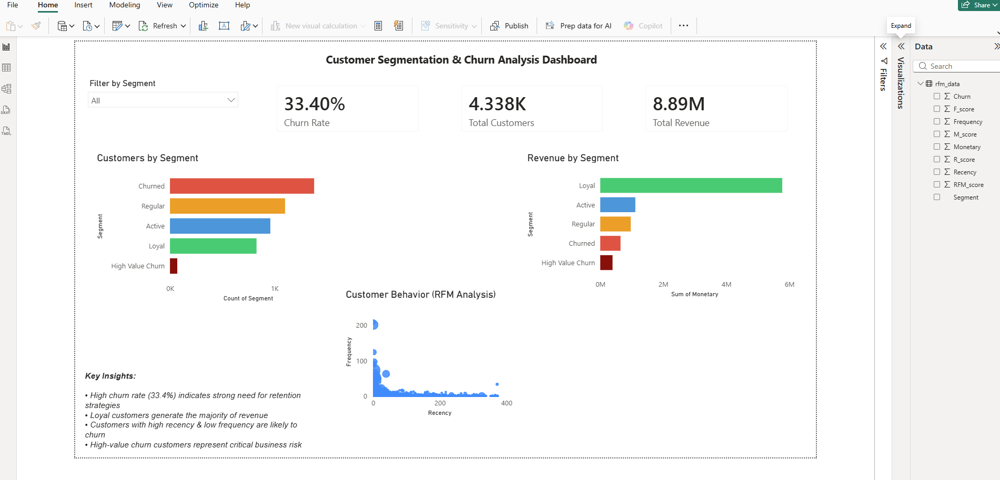

# 📊 Customer Churn Analysis — Identifying At-Risk Customers & Improving Retention

## 📊 Dashboard Preview

> 📌 Built using Power BI with interactive filters and RFM-based customer segmentation

---

## 📌 Executive Summary

This project analyzes customer behavior data to identify churn patterns and understand the key factors driving customer attrition.

Using RFM (Recency, Frequency, Monetary) segmentation and behavioral analysis, the project uncovers high-risk customer groups and highlights opportunities to improve retention strategies.

This project demonstrates how customer segmentation can be leveraged to reduce churn and maximize customer lifetime value.

---

## 📈 Why This Project Matters

Customer retention is more cost-effective than customer acquisition, yet many businesses fail to identify early churn signals.
This project highlights how customer segmentation and behavioral analysis can help reduce churn and improve long-term revenue.

---

## 💼 Business Problem

Businesses often struggle to retain customers due to lack of visibility into churn behavior. Without proper segmentation, companies cannot identify high-risk customers early.

This project aims to:

* Identify customers likely to churn
* Analyze behavioral patterns leading to churn
* Segment customers based on value and engagement

---

## ❓ Key Business Questions

* Which customers are most likely to churn?
* What behavioral patterns indicate churn risk?
* Which customer segments generate the most value?
* How can businesses reduce churn effectively?

---

## 🚀 Project Overview

This is an end-to-end customer churn analysis project using Python, SQL, and Power BI.

The analysis focuses on customer segmentation using RFM (Recency, Frequency, Monetary) and identifying churn risk patterns.

The goal is to enable proactive retention strategies instead of reactive churn handling.

---

## 📊 Visualization Summary

The Power BI dashboard provides insights into customer segments, churn risk, and behavioral trends.

Key visuals include:

* Customer segmentation (RFM-based)
* Churn distribution across segments
* Revenue contribution by customer groups
* Behavioral trends leading to churn

---

## 🎯 Key Insights

* Overall churn rate is ~33%, indicating significant retention challenges
* High-value customers contribute a large portion of revenue but show early signs of churn
* Customers with low recency and frequency are more likely to churn
* Repeat purchase behavior strongly correlates with customer retention
* Certain customer segments show declining engagement before churn, indicating early warning signals

---

## 💡 Business Impact

* Enables early identification of high-risk customers
* Helps prioritize retention efforts for high-value segments
* Improves customer lifetime value (CLV)
* Supports proactive decision-making instead of reactive churn management

---

## 🧠 Recommendations

* Retain high-value customers through personalized offers and loyalty programs
* Target at-risk customers with re-engagement campaigns
* Improve retention by increasing engagement for low-frequency users
* Focus marketing efforts on high lifetime value segments
* Implement early warning systems using RFM-based segmentation

---

## 🛠️ Tools Used

* Python (Pandas)
* SQL
* Power BI
* DAX

---

## ⚙️ Technical Highlights

* Performed data cleaning and preprocessing (handling missing values, type conversions)
* Implemented RFM (Recency, Frequency, Monetary) segmentation
* Conducted exploratory data analysis to identify churn patterns
* Built calculated measures in Power BI using DAX
* Designed an interactive dashboard with filters and drill-down capabilities

---

## 🔄 Project Workflow

1. Data Loading
   Loaded customer dataset using Python

2. Data Understanding
   Explored structure, missing values, and duplicates

3. Data Cleaning
   Handled inconsistencies and prepared dataset for analysis

4. Feature Engineering
   Created RFM metrics (Recency, Frequency, Monetary)

5. Customer Segmentation
   Grouped customers based on behavioral patterns

6. Churn Analysis
   Identified high-risk customer segments

7. Visualization
   Built Power BI dashboard with KPIs and segmentation insights

---

## 📂 Files Included

* `python/customer_churn_analysis.ipynb`
* `data/customer_data.csv`
* `Customer_Churn_Dashboard.pbix`
* `images/dashboard.png`

---

## 📌 Conclusion

Customer churn is not random — it follows identifiable behavioral patterns.
By leveraging segmentation techniques like RFM, businesses can proactively reduce churn and improve long-term customer value.

---

## 📚 Key Learnings

* Customer segmentation is critical for retention strategies
* Behavioral patterns can predict churn risk early
* Data-driven retention strategies improve customer lifetime value
* End-to-end analytics involves data cleaning, segmentation, and storytelling
