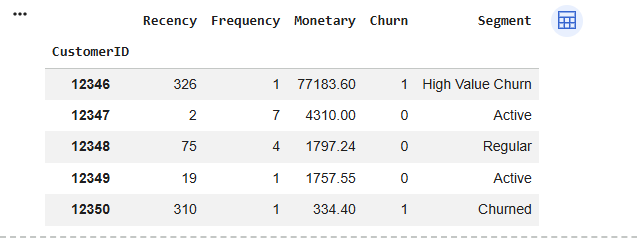
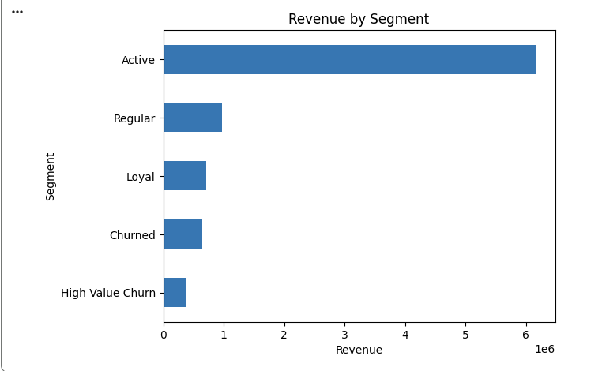
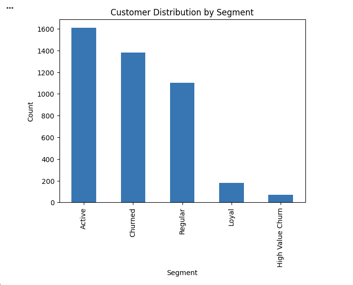
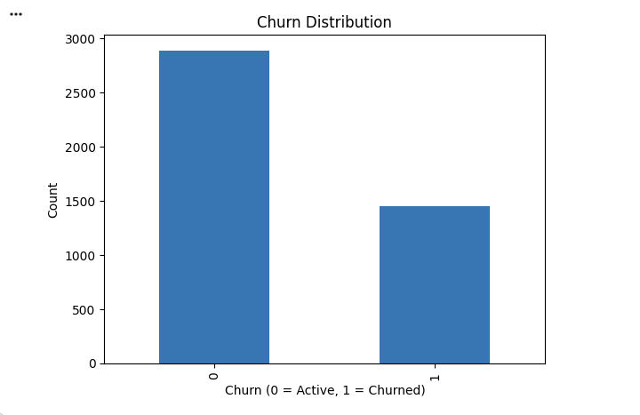
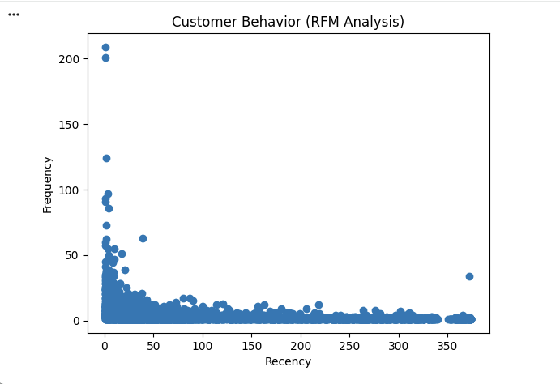
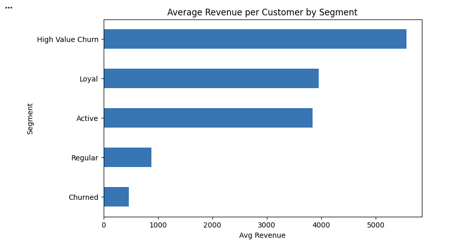
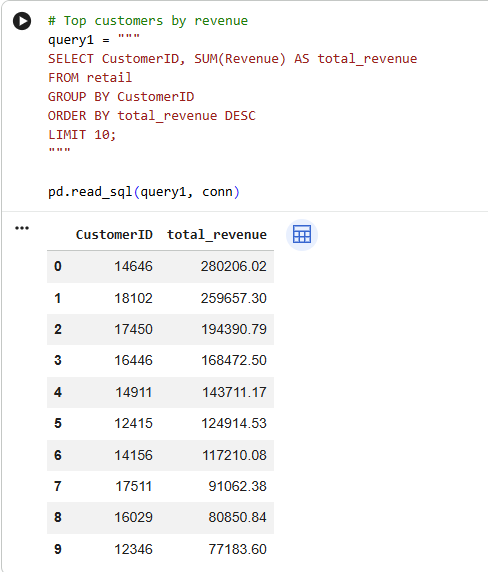
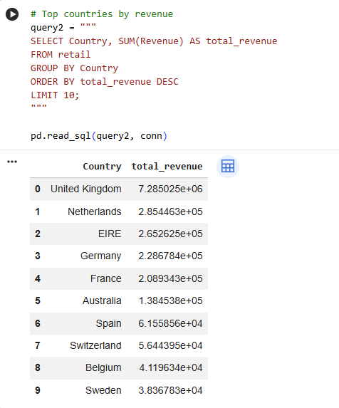
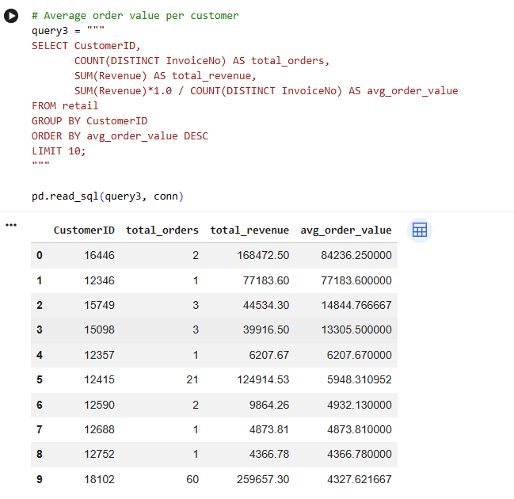

# 📊 Customer Churn Analysis using RFM

## 🚀 Project Overview

This project performs an end-to-end customer churn analysis using **Python, SQL, and Power BI** to understand customer behavior and identify churn patterns.

The main objective is to help businesses:

* Identify high-value customers
* Detect customers likely to churn
* Analyze revenue contribution across segments
* Take data-driven retention decisions

---

## 🧠 Key Concepts Used

* RFM Analysis (Recency, Frequency, Monetary)
* Customer Segmentation
* Churn Detection
* Data Aggregation & SQL Queries
* Data Visualization

---

## 🛠 Tools & Technologies

* Python (Pandas, Matplotlib)
* SQL (SQLite)
* Power BI

---

## 📁 Dataset
The dataset used in this project is not included due to size limitations.

You can download it from:
https://archive.ics.uci.edu/ml/datasets/Online+Retail

---

## 📂 Project Structure

```
customer-churn-analysis-rfm/
│
├── data/
│   └── online_retail.csv
│
├── notebooks/
│   └── customer_churn_analysis.ipynb
│
├── images/
│   ├── dashboard.png
│   ├── customer_segmentation.png
│   ├── avg_revenue_by_segment.png
│   ├── customer_distribution.png
│   ├── revenue_by_segment.png
│   ├── churn_distribution.png
│   ├── rfm_scatter.png
│   ├── sql_top_customers.png
│   ├── sql_revenue_country.png
│   ├── sql_avg_order.png
│
└── README.md
```

---

## 📊 Dashboard


---

## 📌 Customer Segmentation



---

## 📈 Revenue by Segment



---

## 📊 Customer Distribution



---

## 📉 Churn Distribution



---

## 🔍 Customer Behavior (RFM Analysis)



---

## 📊 Average Revenue per Segment



---

## 🧾 SQL Analysis

### 🔹 Top Customers by Revenue



### 🔹 Revenue by Country



### 🔹 Average Order Value per Customer



---

## 🎯 Key Insights

* Active customers contribute the highest revenue
* Approximately **33.4% churn rate** indicates strong need for retention strategies
* High-value churn customers represent significant revenue loss risk
* Customers with high recency and low frequency are more likely to churn

---

## 📌 Conclusion

This project demonstrates how customer segmentation using RFM analysis can help businesses:

* Improve customer retention
* Increase lifetime value
* Make data-driven business decisions

---

## 🔗 Future Improvements

* Add machine learning model for churn prediction
* Deploy dashboard using web applications
* Automate data pipeline

---
